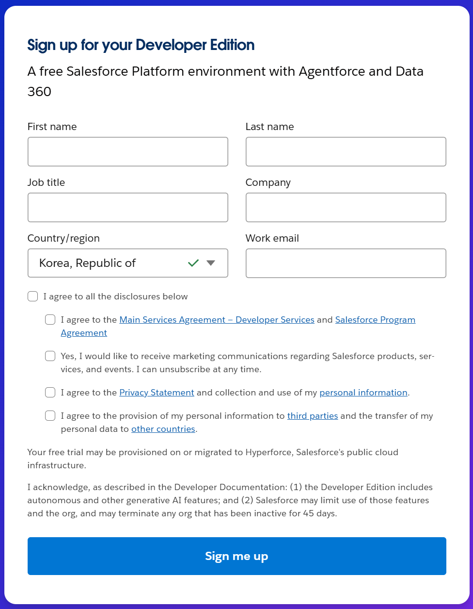

## 연동 대상 Salesforce 서비스 가입
  1. Salesforce 개발자 사이트 접속 ([https://developer.salesforce.com/](https://developer.salesforce.com))
  2. `Try for free` 버튼 클릭
     
  3. 정보를 입력하고 `Sign me up` 버튼 클릭하여 가입
     
  4. 접근 도메인 및 사용자 계정 정보 확인
     입력한 이메일 주소로 URL, 이메일, 비밀번호 재설정 버튼이 포함된 메일이 전송됩니다.

     `https://orgfam-<random code>-dev-ed.develop.my.salesforce.com`

     확인된 도메인은 Entra ID와 인증을 통합할 때 Single Sign On 구성 단계에서 사용됩니다.