# MSAL 실습을 위한 Github Codespace 생성 가이드
GitHub 계정 생성부터 Codespace 실행까지 단계별로 안내합니다.

---

## Step 1. GitHub Codespaces 소개 페이지 접속

[https://github.com/features/codespaces](https://github.com/features/codespaces) 에 접속하면 GitHub Codespaces 소개 페이지를 확인할 수 있습니다.  

**GitHub 계정이 있다면** `[무료로 시작하기]` 버튼이나 `[로그인(Sign in)]` 버튼을 통해 로그인을 합니다.  
**Github 계정이 없다면** `[가입(Sign up)]` 버튼을 통해 신규 가입을 시작합니다.

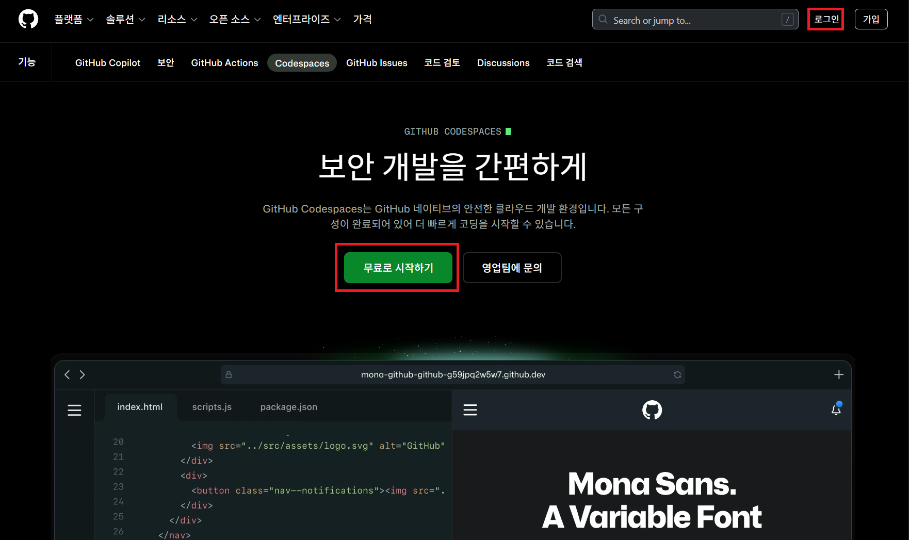

---

## Step 1-1. GitHub 계정이 있는 경우

Github 로그인 후 오른쪽 상단의 `[Dashboard]` 버튼을 통해 Github 대시보드로 이동합니다. 이 후 `Step 3`에서 이어서 진행합니다.

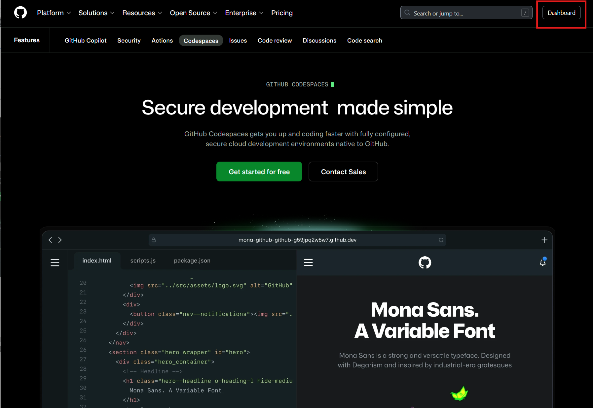

---

## Step 2. GitHub 계정 생성

계정이 없는 경우 `[Create your free account]` 페이지에서 이메일, 사용자명 등을 입력하여 계정을 생성합니다.  
이메일은 반드시 메일 수신이 가능한 메일 주소를 사용해야 합니다. 등록한 이메일 주소로 Github 실행 코드가 전달됩니다.

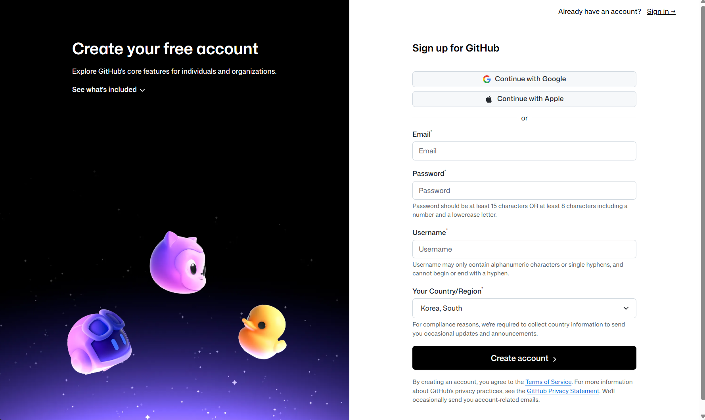

---

## Step 2-1. 소셜 계정으로 가입 (Google)

Google 이나 Apple의 계정이 있다면 `[Continue with Google]` 이나 `[Continue with Apple]`을 선택하여 소셜 계정으로 진행할 수 있습니다.

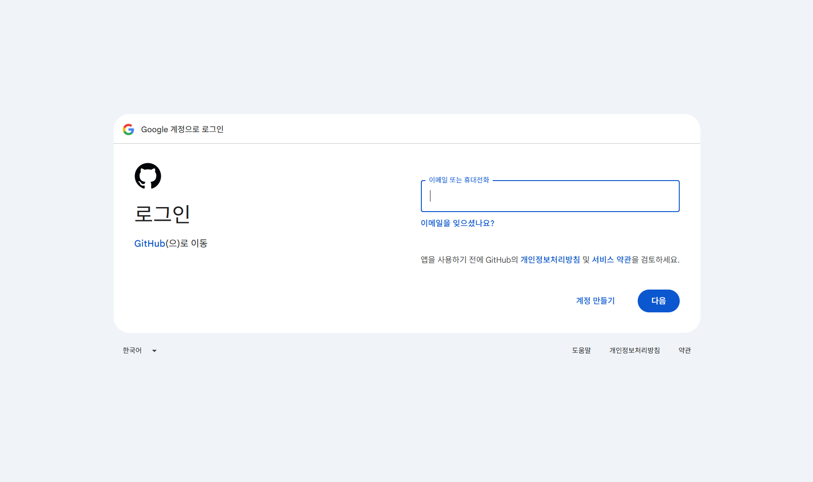

GitHub 에서 Google 계정 정보(이름, 이메일)에 접근하는 것을 허용합니다. `[계속]` 버튼을 클릭합니다.

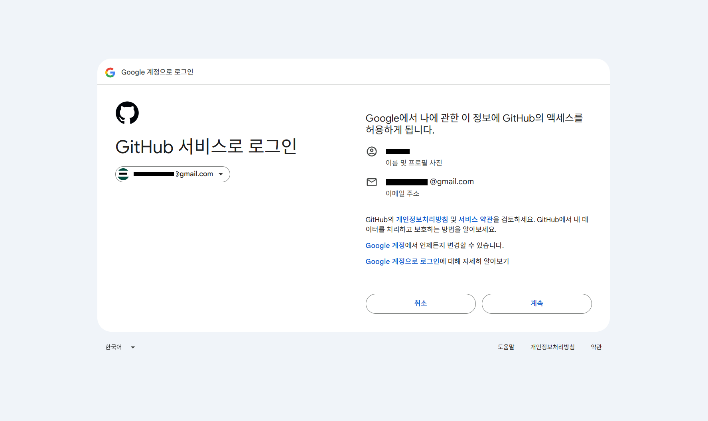

---

## Step 2-2. 계정 정보 입력 및 인증

이메일과 사용자명이 자동 입력됩니다. 내용을 확인한 후 `[Create account]` 버튼을 클릭합니다.

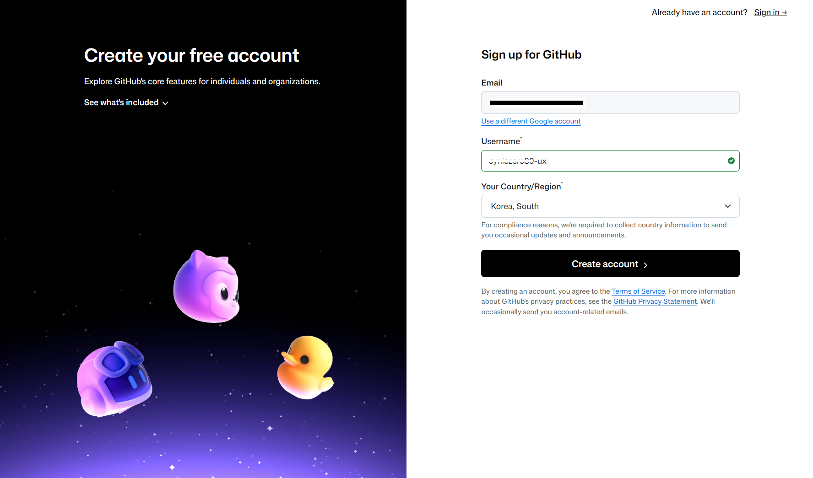

계정 생성 과정에서 상황에 따라 계정 보안 인증(CAPTCHA)이 필요할 수 있습니다. `[Visual puzzle]`을 선택하면 시각적 퍼즐 방식으로 인증합니다. 퍼즐은 상황에 따라 다른 퍼즐이 나타납니다.

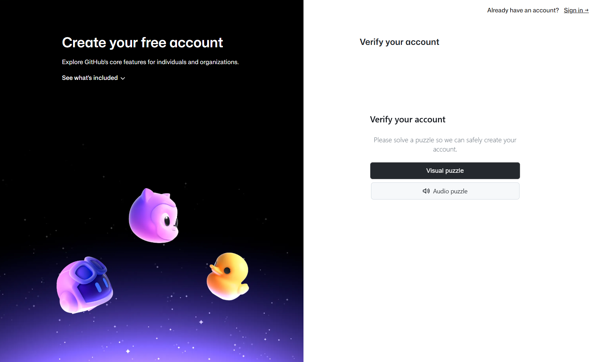

---

## Step 3. GitHub 대시보드 접속 확인

인증 완료 후 GitHub 대시보드(Home)로 진입됩니다. 이제 `Codespace`를 사용할 수 있습니다.

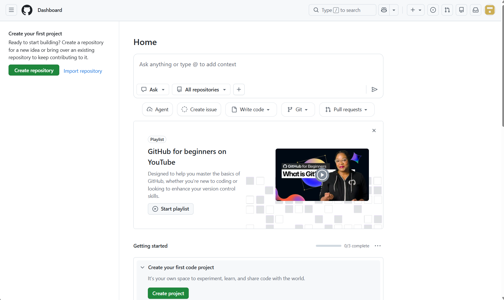

---

## Step 4. Codespace 메뉴로 이동

좌측 사이드바에서 `[Codespaces]` 항목을 클릭합니다.

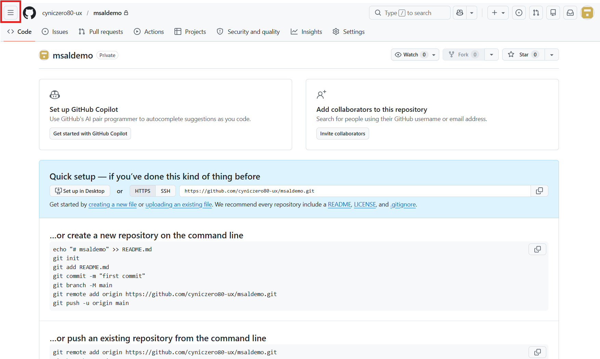

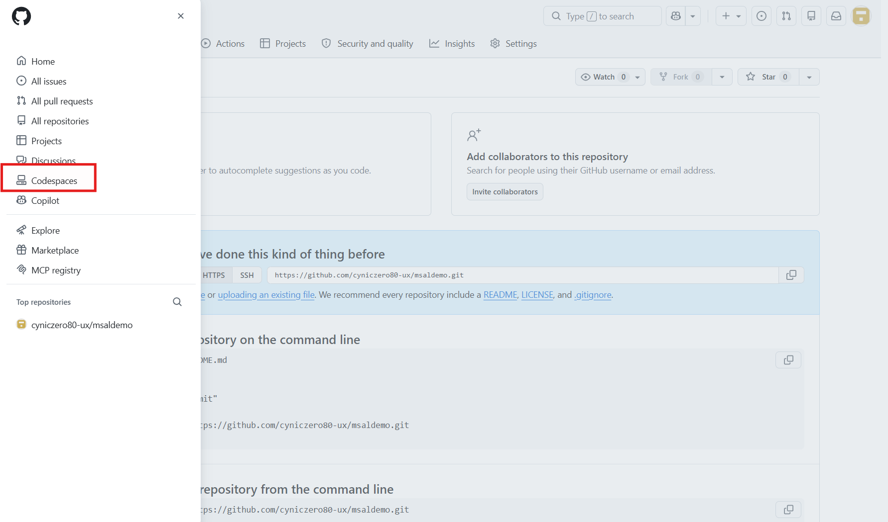

Codespace 메인 페이지가 열립니다.  
다음으로 하단의 템플릿 중 `[.NET]`을 확인한 후 `[Use This Template]` 버튼을 통해 `.NET` 개발용 Codespace를 생성합니다.

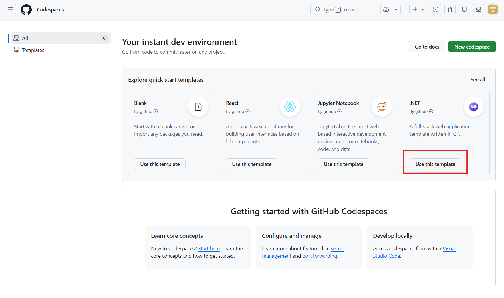

[Use this template] 버튼을 누를 때마다 Codespace 환경이 계속 추가됩니다. 최초 1회 생성시에만 해당 버튼을 사용하고 이후는 생성된 환경을 선택하여 개발환경에 진입합니다.

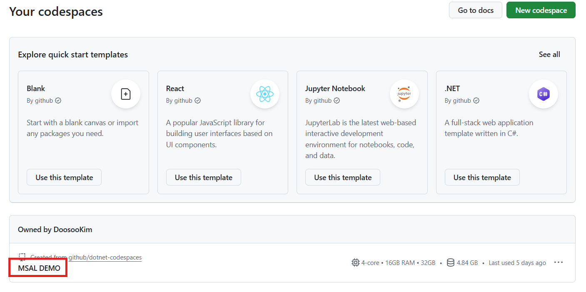

---

## Step 5. Codespace 실행 완료

일정 시간 후 Codespace가 생성되면 브라우저에서 `VS Code` 환경이 열립니다.  
이제 터미널, 파일 탐색기, 에디터를 통한 실습을 진행할 수 있습니다.

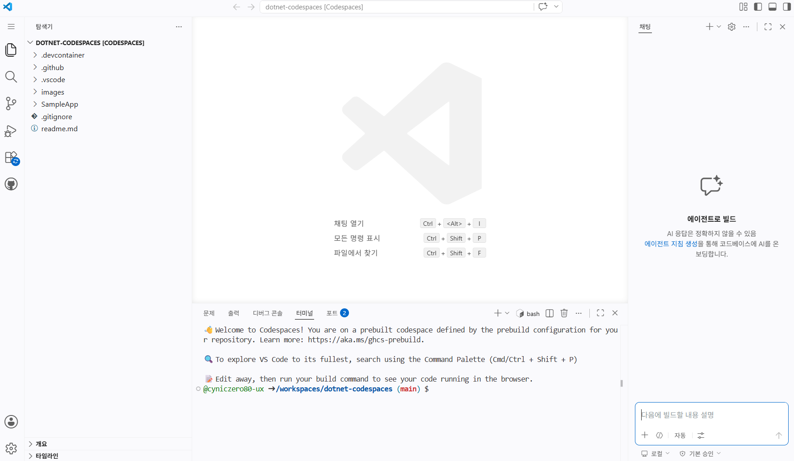

---

## Step 6. 실습 코드 다운로드

- **(주의)** 진행과정에서 vscode 영역에서 마우스 우클릭 동작을 하는 경우 아래 이미지와 같은 복사 붙여넣기를 위한 클립보드 사용 요청이 표시됩니다.  
`[허용]`을 선택해야 이 후 원활한 진행이 가능합니다.

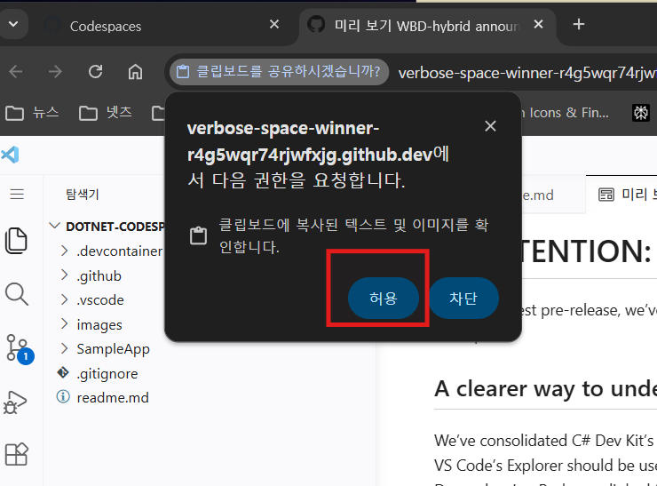

<br>

- 만약 클립보드 붙여넣기 팝업 창을 실수로 닫은 경우 브라우저의 주소창 영역에서 클립보드 사용을 허용할 수 있습니다.
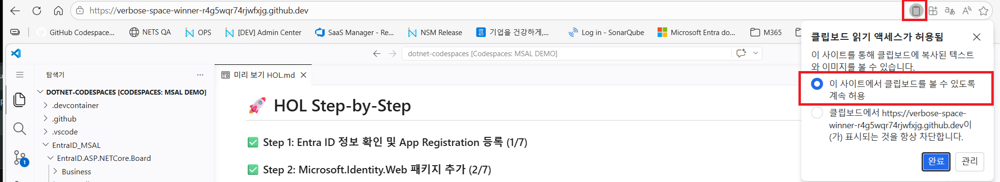

1. 화면 하단의 터미널 탭 선택 후 예제 파일 다운로드 명령어를 입력 후 엔터키를 입력합니다.
```cmd
git clone https://github.com/NETS-SecurityLabs/EntraID_MSAL.git
```
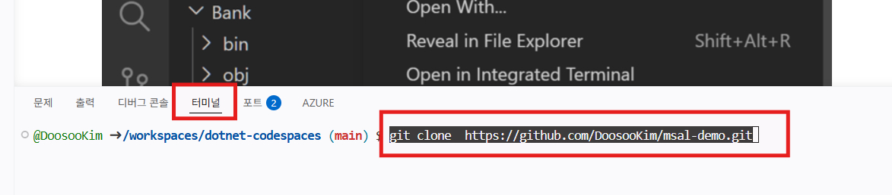

2. 파일이 정상적으로 다운로드 되면 아래와 같이 EntraID_MSAL 폴더가 생성됩니다.
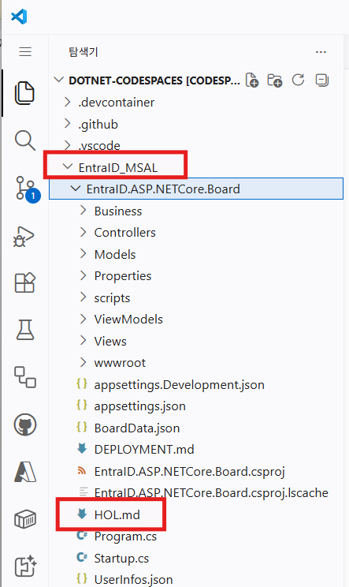

이 후 EntraID_MSAL > EntraID.ASP.NETCore.Board 순으로 폴더를 확장하여 HOL.md 파일을 확인합니다.
해당 파일에서 마우스 우클릭 후 **미리 보기 열기**를 선택합니다.

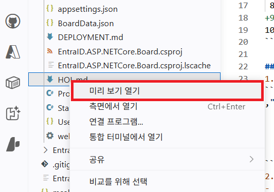

나머지 과정은 HOL.md 파일을 통해 진행됩니다.

---

## Appendix

- <b>"Maximum running codespaces reached"</b> 오류 메시지
무료 버전의 Github codespace는 동시에 두 개의 codespace를 실행할 수 없습니다.
만약 [Use this template] 버튼을 통해 둘 이상의 codespace가 생성된 경우 둘 중 하나는 정지되어 있어야 합니다.

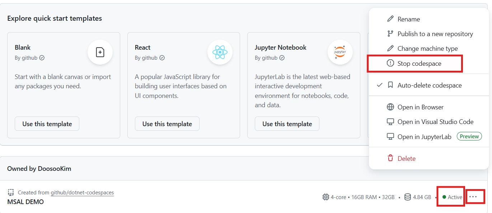

- <b>"Setting up your codespace"</b> 단계에서 멈춤현상
드물게 아래의 화면과 같이 codespace 환경의 준비 도중 진행이 되지 않는 현상이 있습니다.
이 경우 사용중인 환경을 변경해서 다시 시도해 보시기 바랍니다.

1. 네트워크 환경 변경(wifi AP 변경 혹은 테더링을 통한 접속)
2. 접속 브라우저 변경(다른 브라우저 사용 혹은 in-private 모드 사용 등)

정확한 원인은 확인되지 않았고 상기의 조치로도 현상이 해소되지 않는 경우도 있습니다.

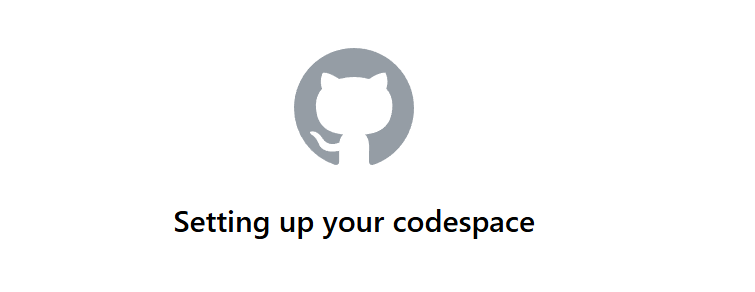