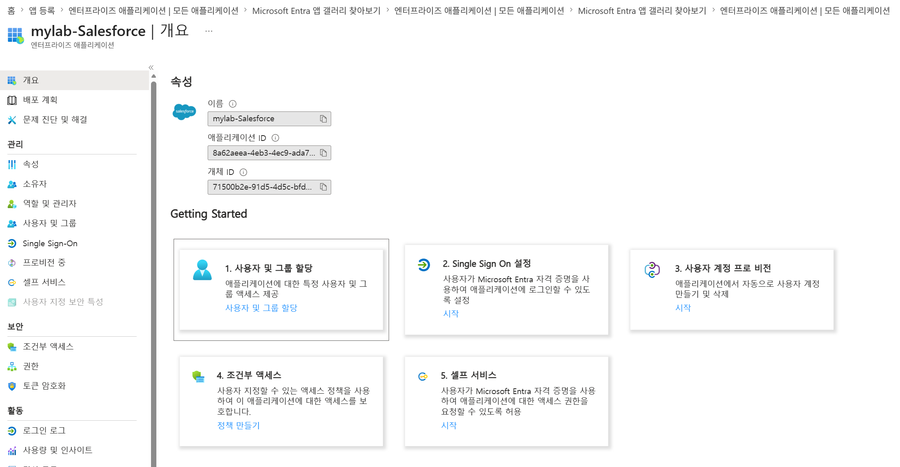
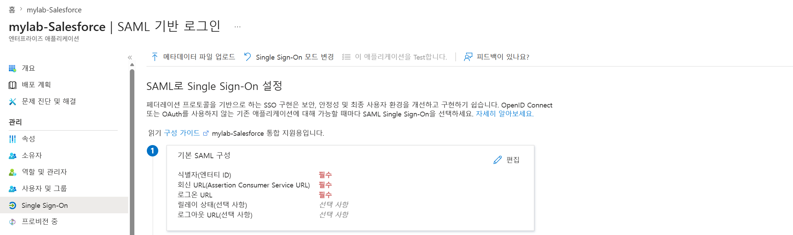

## 관리자 페이지 열기
  1. Entra ID 관리 사이트 접근 (<a href="https://entra.microsoft.com/" target="_blank" rel="noopener noreferrer">https://entra.microsoft.com/</a>)

## Salesforce 도메인 확인하기
  1. <<생성한 도메인 주소를 확인하기>>

## 앱 등록하기
  1. 좌측 메뉴에서 Entra ID > 엔터프라이즈 앱 선택
  2. + 새로운 애플리케이션 버튼 클릭
  3. 애플리케이션 검색 박스에 "salesforce" 입력하여 검색
  4. 검색 결과에서 "Salseforce" 타일 선택
  5. 우측 팝업 에서 이름을 "<name>-Salesforce"로 지정
  6. 만들기 버튼 클릭하여 앱 등록 완료
  </img>

## Single Sign On 설정: IdP에 SP의 정보 기록하기
  1. 앱 목록에서 생성한 "<name>-Salesforce" 앱 선택
  2. 개요 페이지에서 "2. Single Sign On 설정" 타일 또는 "시작" 링 선택
     </img>
  3. Single Sign-On 방법 선택 에서 SAML 타일 선택
  4. 기본 SAML 구성 섹션의 편집 링크 선택
     </img>
  5. 우측 팝업에서 "식별자 추가" 링크 클릭
  6. 식별자 입력 란에 <<생성한 도메인 주소>> 를 붙여넣기
  7. "답장 URL 추가" 링크 클릭
  8. 회신 URL 입력 란에 <<생성한 도메인 주소>> 를 붙여넣기
  9. 로그온 URL 입력 란에 로그온 URL 확인 후 붙여넣기
    <<로그온 URL 확인 방법>>
