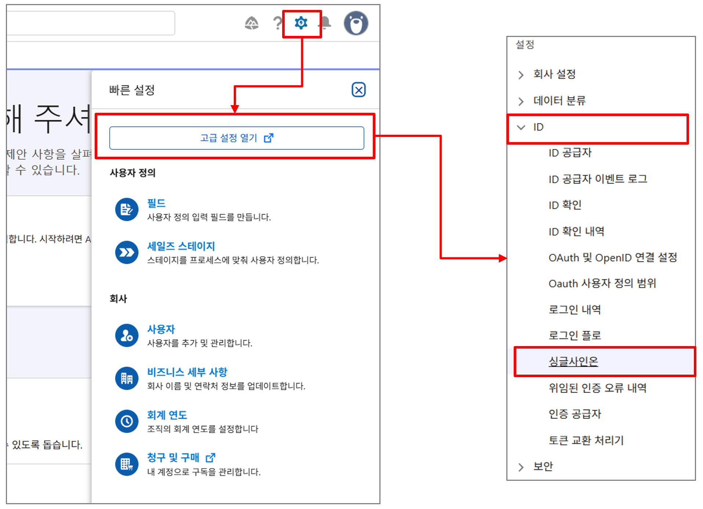
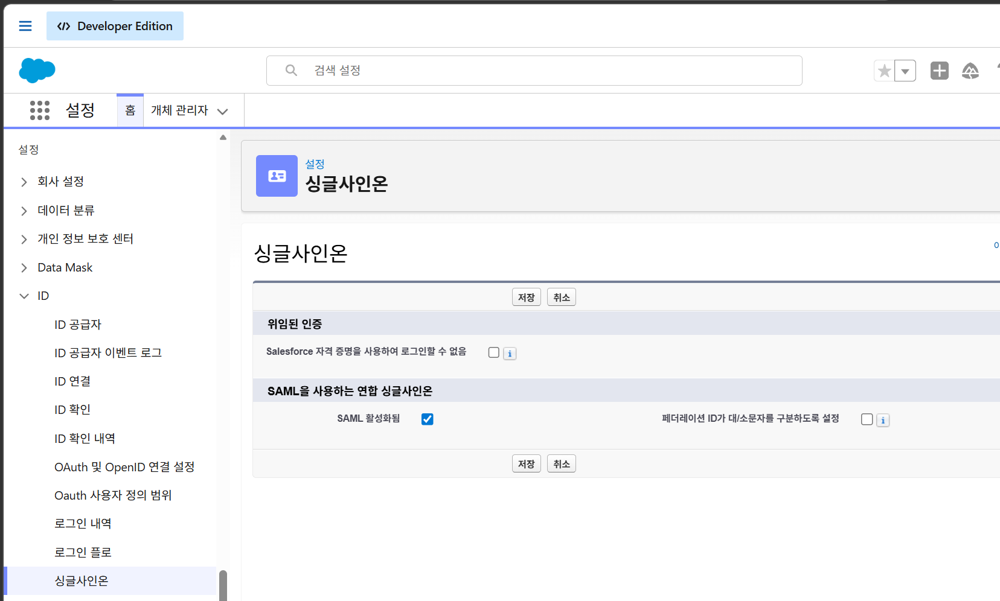
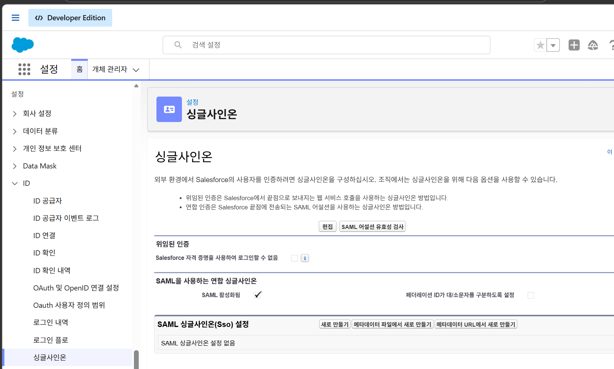
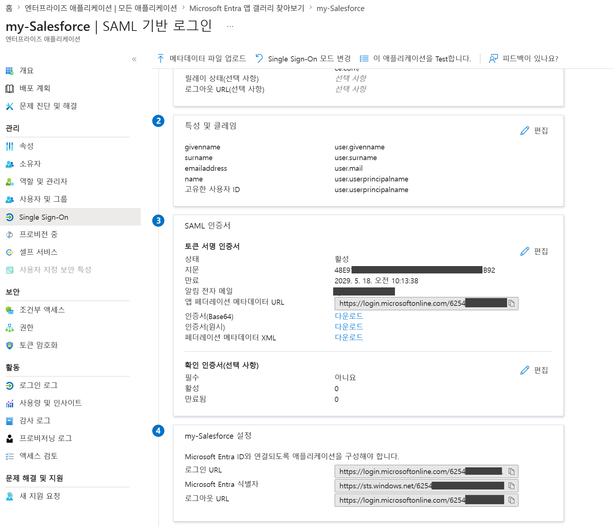
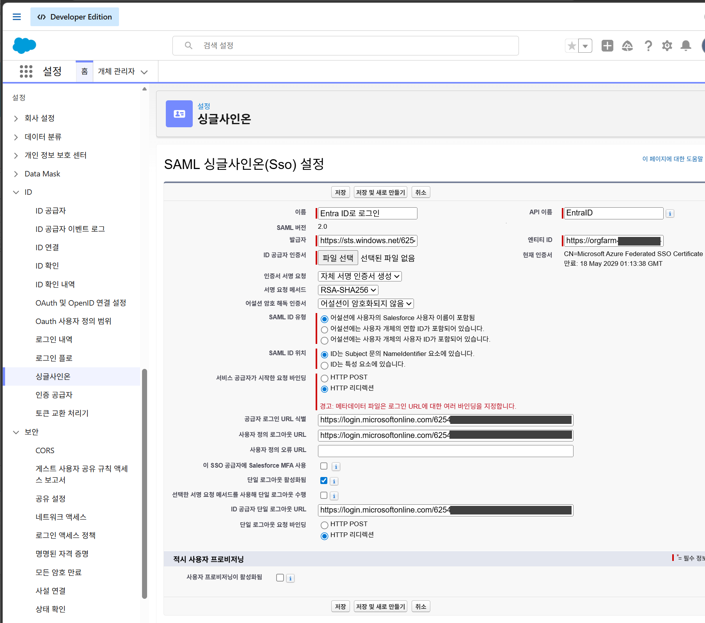
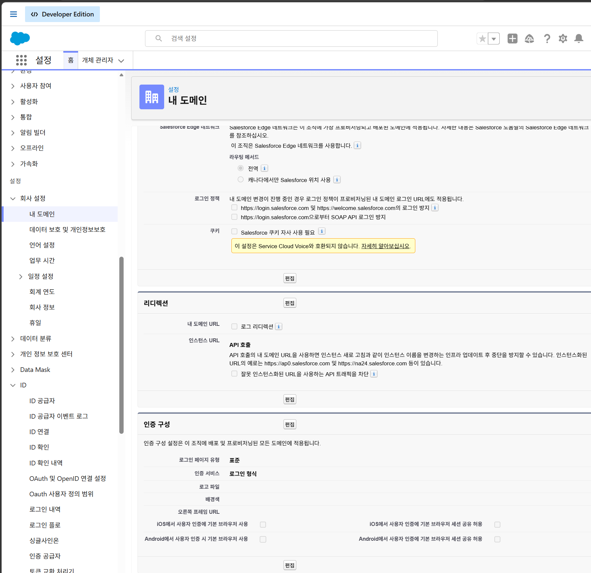

## Salesforce 로그인
  1. [EID Lab 사전 준비사항](EID%20Lab%20사전%20준비사항.md) 참고하여 접근 도메인 및 관리자 계정 확인
  2. 브라우저에서 생성된 Salseforce URL로 접근(`https://orgfarm-<random key>-dev-ed.develop.my.salesforce.com/`)
  3. 관리자 계정을 입력하여 로그인

## SSO 기능 구성
  1. 우측 상단의 `설정(기어 아이콘)` 메뉴를 클릭한 후 `설정-현재 앱 설정` 메뉴 선택
  2. 새로 열련 창의 좌측 메뉴에서 `설정` > `ID` > `싱글사인온` 선택

     
  3. `편집` 버튼 클릭 > 'SAML 활성화됨' 체크 > `저장` 버튼 클릭

     
  4. `SAML 싱글사인온(Sso) 설정` 섹션에서 `메타데이터 파일에서 새로 만들기` 버튼 클릭
  5. `파일 선택` 버튼을 클릭하고 Entra ID에서 다운로드 받은 페더레이션 메타데이터 XML 파일 선택
  6. `만들기` 버튼 클릭하여 

     

## Entra ID에서 로그아웃 URL 복사
  1. Entra ID의 엔터프라이즈 앱에서 생성한 앱 선택
  2. Single Sign-On 메뉴에서 `(4)<name>-Salesforce 설정` 섹션 확인
  3. 로그아웃  URL 의 값 복사

     

## Salesforce의 SSO 기능 구성 화면에서
  1. 새로 만든 `SAML 싱글사인온(Sso) 설정` 화면의 `사용자 정의 로그아웃 URL`에 복사한 값 붙여넣기
  2. 이름 기본값(sts)을 `Entra ID로 로그인` 으로 변경
  3. API 이름 기본값(sts)을 'EntraID'로 변경
  4. `저장` 버튼 클릭
  
     

## Salesforce의 로그인 방법 설정(Entra ID 인증 사용)
  1. Salseforce의 `설정` > `회사 설정` > `내 도메인` 으로 이동
  2. `인증 구성` 섹션에서 `편집` 버튼 클릭
  
     

  3. `인증 구성` 섹션의 `인증 서비스` 항목에서 `Entra ID로 로그인` 항목 선택(체크)
  4. `저장` 버튼 클릭
  

