## 관리자 페이지 열기
  1. Entra ID 관리 사이트 접근 ([https://entra.microsoft.com/](https://entra.microsoft.com/))
  2. 앱 관리자 권한이 있는 사용자 계정으로 로그인

## Salesforce 도메인 확인하기
  1. [Lab 사전 준비사항1](Lab%20사전%20준비사항1.md) 참고하여 접근 도메인 확인

## 앱 등록하기
  1. 좌측 메뉴에서 Entra ID > 엔터프라이즈 앱 선택
  2. `+ 새로운 애플리케이션` 버튼 클릭
  3. 애플리케이션 검색 박스에 "salesforce" 입력하여 검색
  4. 검색 결과에서 "Salseforce" 타일 선택
  5. 우측 팝업 에서 이름을 `<name>-Salesforce`로 지정
  6. 만들기 버튼 클릭하여 앱 등록 완료
  <a href="#void">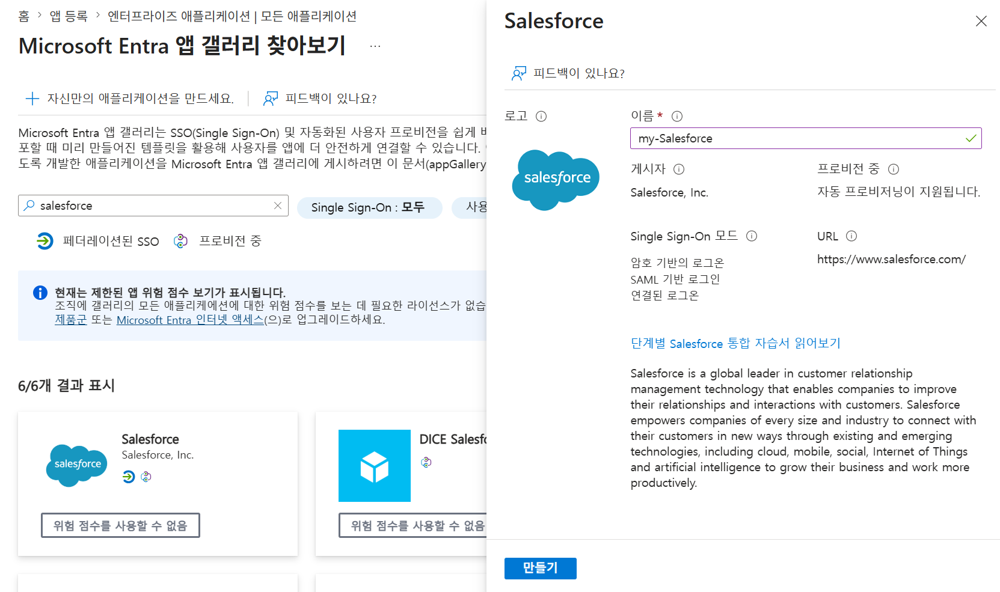</a>

## Single Sign On 설정: IdP에 SP의 정보 기록하기
  1. 앱 목록에서 생성한 `<name>-Salesforce` 앱 선택
  2. 개요 페이지에서 `2. Single Sign On 설정` 타일의 `시작` 링크 선택
     <a href="#void">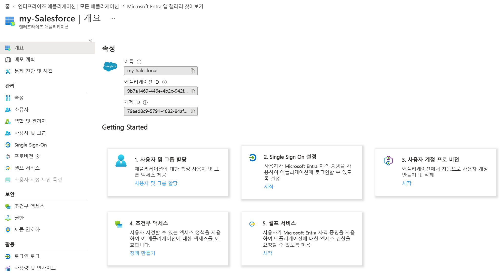</a>
  3. `Single Sign-On 방법 선택` 에서 `SAML` 타일 선택
     <a href="#void">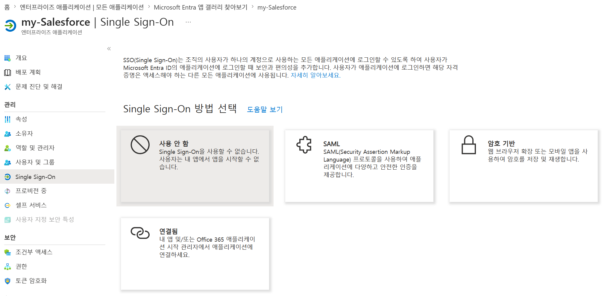</a>
  4. (1)기본 SAML 구성 섹션의 `편집` 링크 선택
     
  5. 우측 팝업에서 `식별자 추가` 링크 클릭
     <a href="#void">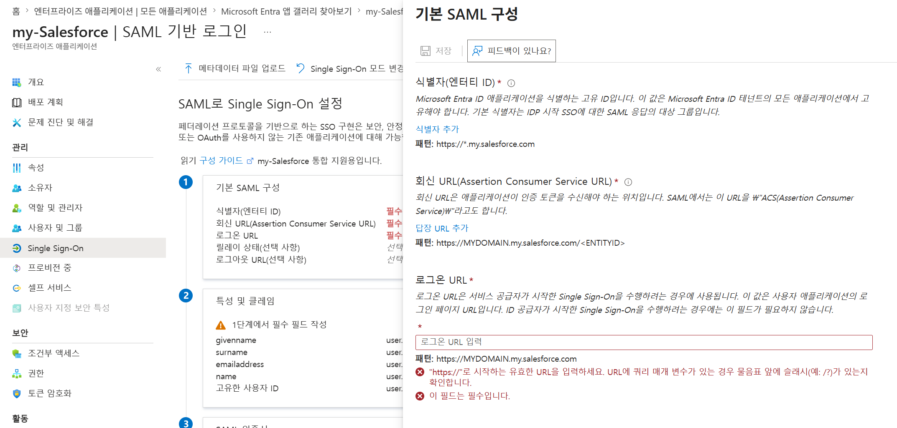</a>
  6. 식별자 입력 란에 <<확인된 Salesforce 도메인 주소>> 를 붙여넣기
     <a href="#void">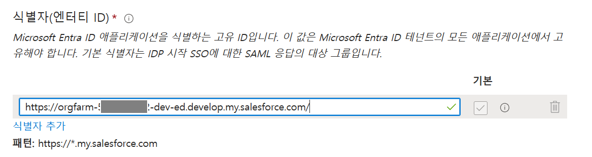</a>
  7. `답장 URL 추가` 링크 클릭 클릭하여 같은 URL 붙여넣기
  8. `로그온 URL` 입력 란에 같은 URL 붙여넣기
  9. `특성 및 클레임` 에서 '편집' 클릭
     <a href="#void">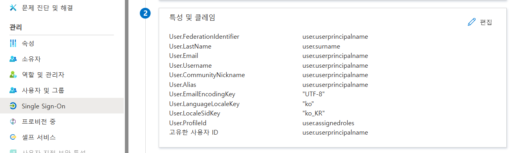</a>     
  10. `+ 새 클레임 추가` 클릭
     <a href="#void">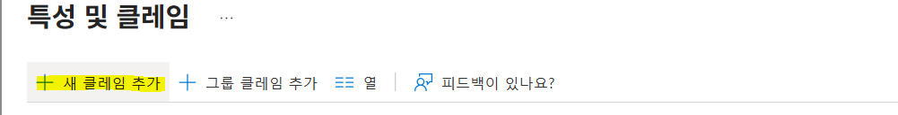</a>     
  11. 클레임 관리 에서 `이름`에는 Salesforce 속성명 입력, `원본 특성` 에는 Entra ID 속성 선택
     <a href="#void">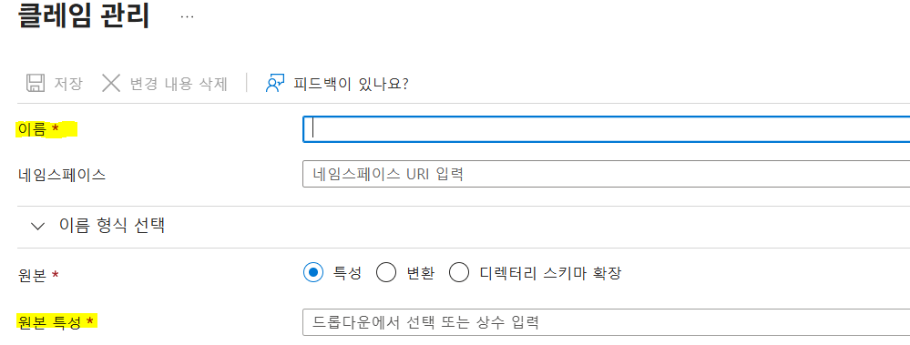</a> 
  12. `아래 리스트에 있는 클레임은 전부 추가 해야 합니다.`   단, User.Profileld 속성의 값은 상수값 `00eNS00000JykTK` 값을 그대로 입력 합니다
     <a href="#void">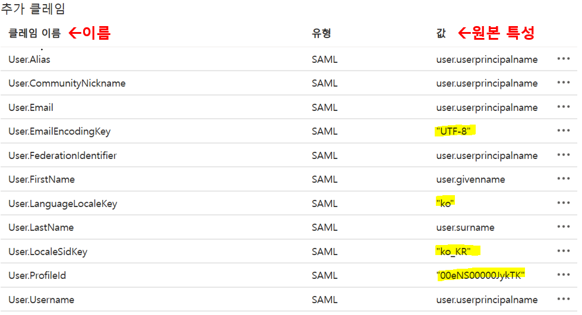</a>            
  13. 상단의 `저장` 버튼을 클릭하여 작성한 내용 반영

## 앱 속성 변경
  1. `<name>-Salesforce` 앱의 `속성` 메뉴에서 `할당이 필요함니까?` 항목을 `예`로 변경
  2. 화면 아래쪽의 `저장` 버튼 클릭하여 변경 내용 저장

## 로그인 대상 사용자 추
  1. `<name>-Salesforce` 앱의 `사용자 및 그룹` 메뉴에서 클릭 후 `+사용자/그룹추가` 버튼 클릭
      <a href="#void">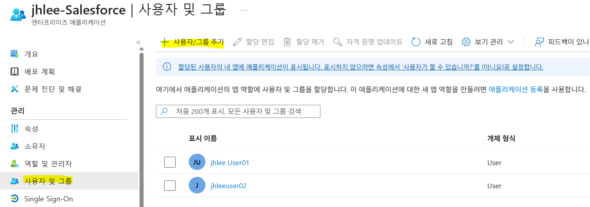</a>
  2. `사용자 및 그룹` 메뉴에서 `선택된 항목 없음` 클릭 후 사용자 검색 하여 체크 후 `선택` 버튼 클릭
      <a href="#void">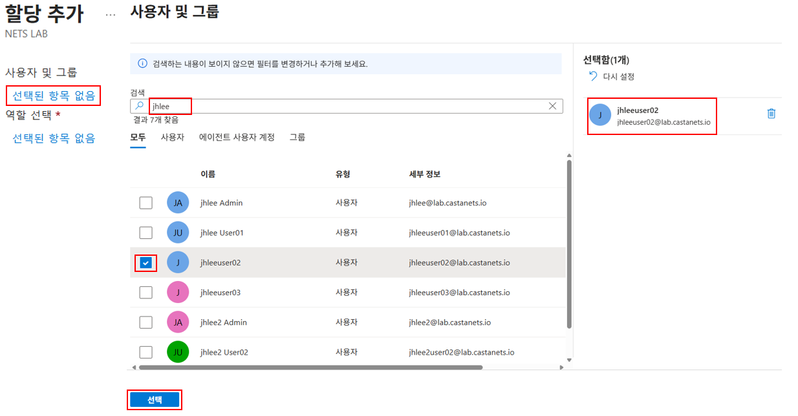</a>
  3. `역할 선택` 메뉴에서 `선택된 항목 없음` 클릭 후 `Chatter Free User` 선택 후 `할당` 버튼 클릭
      <a href="#void">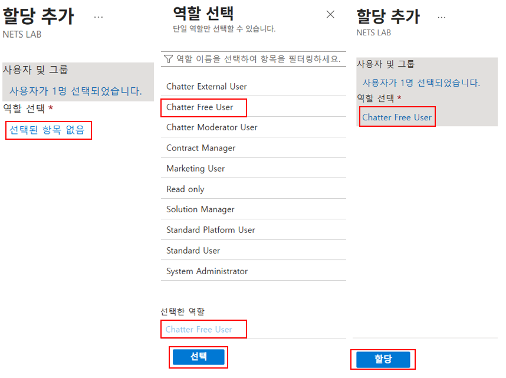</a>
  3. 화면 아래쪽의 `저장` 버튼 클릭하여 변경 내용 저장

## SP에 제공할 메타데이터 XML 다운로드
  1. (3)SAML 인증서 섹션에서 `페더레이션 메타데이터 XML`에 대한 `다운로드` 링크 클릭
     <a href="#void">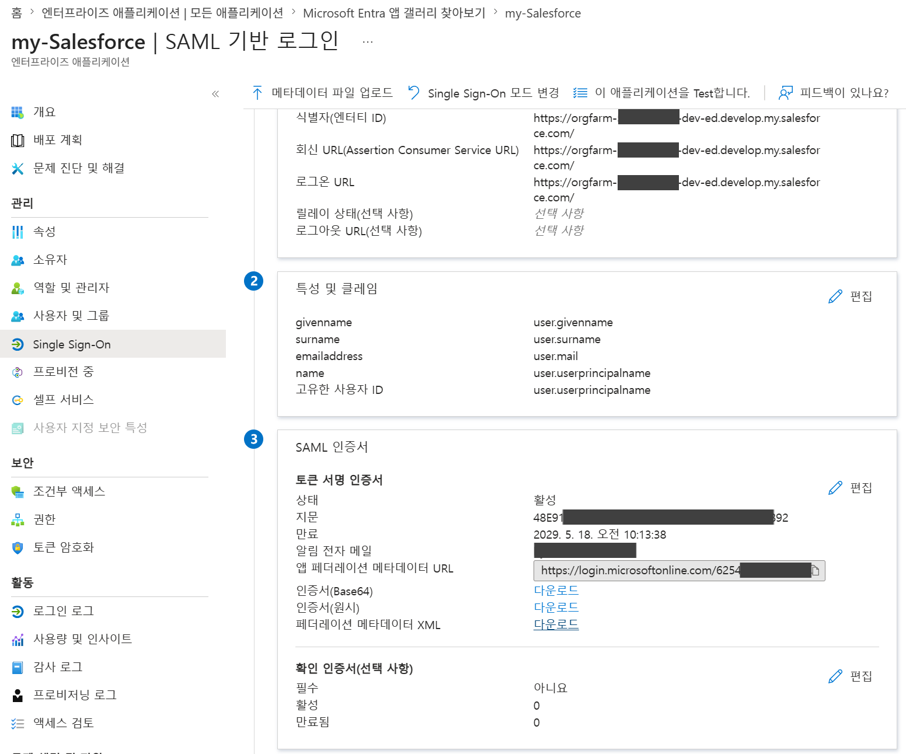</a>
